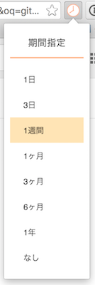

# GoogleSearchTimePeriod
Google検索に期間指定を追加するGoogle Chromeの拡張機能です。

## インストール

[リリースページ](https://github.com/morikuni/GoogleSearchTimePeriod/releases)から最新版の`GoogleSearchTimePeriod.crx`をダウンロードして、Google Chromeの拡張機能画面にドラッグ＆ドロップします。

## カスタマイズ

ソースコードをダウンロードして[popup.html](./popup.html)内の`<li>`タグを編集すれば、好きな期間指定を追加・削除することができます。

編集後は、Google Chromeの拡張機能画面の「デベロッパーモード」を有効にし、「パッケージ化されていない拡張機能を読み込む...」でディレクトリ毎読み込むか、「拡張機能のパッケージ化...」からパッケージ化を行ってインストールしてください。
